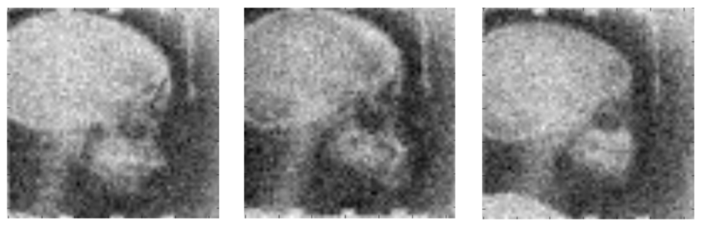
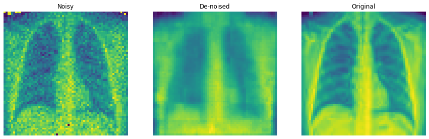
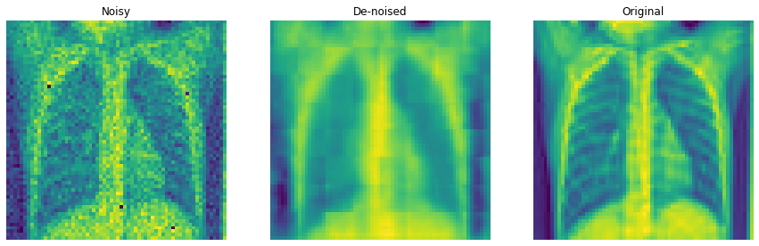

# xray image denoising 

Exploration of various neural network architectures that perform image denoising.  




This data comes from a [kaggle dataset](https://www.kaggle.com/paultimothymooney/chest-xray-pneumonia).  It contains chest x-ray images of individuals with and without pneumonia.   


## Background 
Noise is information that is not part of a desierd signal.  For x-ray images, noise in the image can be caused by measurement errors or efforts to reduce patient's exposure to radiation.  Denoising is often required for proper diagnostic analysis by medical professionals.  Competent denoising software exists on the market, but there is still research interest due to: 
+ limited datasets for niche domains...specific diseases that don't have huge sample sets available (e.g. COVID-19)
+ extreme cases of noisy images that software cannot handle 
+ limited applicable use cases for software 

We will explore neural network models that perform image denoising on x-ray images of chest x-ray images.  The dataset includes clean x-ray images.  In this study, we will corrupt the image with various types of noise to produce training data.  


## Autoencoder 

The first neural network architecture of interest are autoencoders.  It is a bow-tie shape network that condenses an input into a low dimensional latent space and then expands it out into an output that is similar to the input.  This architecture excels that captures latent information about the domain of inputs and excluding any noise.  Noise can be isolated by the loss function that compares the inputs to the outputs of the model.   

```
encoder = tf.keras.Sequential([
        tf.keras.layers.InputLayer(input_shape=(64, 64, 1)),
        tf.keras.layers.Conv2D(filters=32, kernel_size=3, strides=(2, 2), activation='relu'),
        tf.keras.layers.Conv2D(filters=64, kernel_size=3, strides=(2, 2), activation='relu'),
        tf.keras.layers.BatchNormalization(), 
        tf.keras.layers.Flatten(),
        # No activation
        tf.keras.layers.Dense(LATENT_DIM) 
        ])

decoder = tf.keras.Sequential([
        tf.keras.layers.InputLayer(input_shape=(LATENT_DIM,)),
        tf.keras.layers.Dense(units=8*8*32, activation=tf.nn.relu),
        tf.keras.layers.Reshape(target_shape=(8, 8, 32)),
        tf.keras.layers.Conv2DTranspose(filters=64, kernel_size=3, strides=4, padding='same',
            activation='relu'),
        tf.keras.layers.Conv2DTranspose(filters=32, kernel_size=3, strides=2, padding='same',
            activation='relu'),
        # No activation
        tf.keras.layers.Conv2DTranspose(filters=1, kernel_size=3, strides=1, padding='same'),
        ])

```


Below is the model run aginst a test set image.  
 


## Variational Autoencoder (VAE)  

The variational autoencoder (VAE) is a variant of the autoencoder architecture.  Instead of a latent dimension space of _d_, the variation autoencoder produces _2*d_ latent variables.  These variables are parameters to a probabalistic function that represents the actual latent features.  Thus, the _2*d_ parameters are used to sample _d_ parameters that are then passed through the decoder.  This architecture has more success in generative modeling since it attempts to model the probability distribution of the latent space instead of the values of the latent space directly.  Because of this, random numbers within a given range are more agreeable with the decoder.  

The last layer of the encoder is: 
```
        tf.keras.layers.Dense(LATENT_DIM + LATENT_DIM) 
```

Additional sampling functions are created to complete the connection between the encoder and decoder.  The sampling has no effect on backprop.  

Below is a gif that shows generated images using randomly sampled numbers passed through the sampler and then the decoder at various epochs during training.  The result is an image that somewhat shows how well the model has 'understood' the domain or captured the true latent features.  

  


The VAE produces more smoothed images than the autoencoder.  
  


## Autoencoder with skip-connections 


## References
+ https://web.stanford.edu/class/cs331b/2016/projects/zhao.pdf
+ https://arxiv.org/pdf/1603.09056.pdf
+ https://github.com/flyywh/Image-Denoising-State-of-the-art
+ https://arxiv.org/pdf/1803.01314.pdf  


